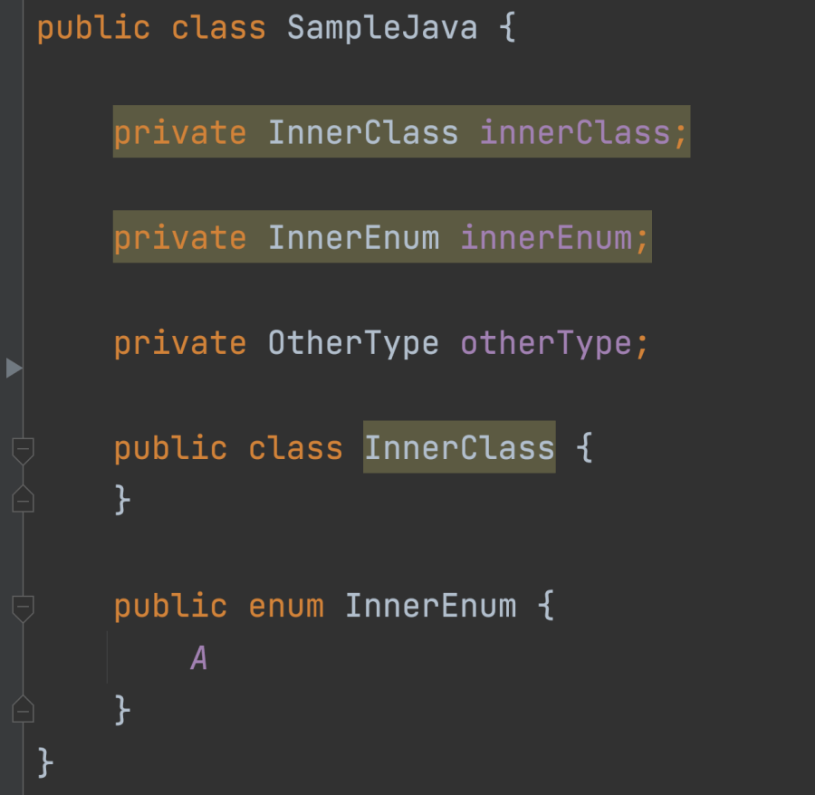

# Android Studio 에서 동작하는 Lint 공부하는 레포

## Android Custom Lint

https://github.com/googlesamples/android-custom-lint-rules

## Debug

UAST Tree 검사

1. Help | Edit Custom Properties
   1. idea.is.internal=true
   2. Restart IDE

2. Tools | Internal Actions | UAST | Dump UAST Tree (By Each PsiElement)

> Enabling Internal Mode : https://plugins.jetbrains.com/docs/intellij/enabling-internal.html
>
> Inspecting UAST Tree : https://plugins.jetbrains.com/docs/intellij/uast.html#inspecting-uast-tree

## Sample 

### 1) Exclude First Comment

1. Java/Kotlin 파일에 존재하는 Local Property/Field를 Detect
2. 필드 정의보다 앞에 존재하는 Document, Comment는 제외

> Detector Source : [PropertyWithExcludeFirstCommentDetector](https://github.com/Pluu/LintStudy/blob/master/lint/src/main/java/com/pluu/lint/PropertyWithExcludeFirstCommentDetector.kt)

#### Preview

|               Kotlin                |               Java                |
| :---------------------------------: | :-------------------------------: |
|  |  |
|  |  |

### 2) Inner Class Checker On Java

Java 클래스 내에서 선언한 필드 중 동일한 클래스 내의 Inner 타입 필드를 Detect

|                           Java                            |
| :-------------------------------------------------------: |
|  |

### 3) Find Method With Argument

특정 함수 & 특정 파라미터 값을 사용하는 케이스를 Detect 

|               Kotlin               |               Java               |
| :--------------------------------: | :------------------------------: |
|  |  |

### 4) Using safe 'use' functions for TypedArray

TypedArray 사용시 AutoCloseable use 사용시 이슈

|                        Kotlin                         |
| :---------------------------------------------------: |
|  |

### 5 Required attribute in CustomView

|   XML   |
| :--: |
|  |
