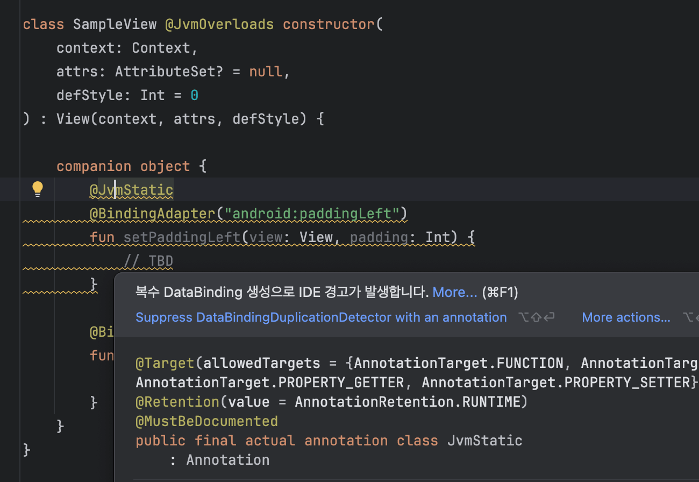

# Android Studio 에서 동작하는 Lint 공부하는 레포

## Android Custom Lint

https://github.com/googlesamples/android-custom-lint-rules

## Debug

UAST Tree 검사

1. Help | Edit Custom Properties
   1. idea.is.internal=true
   2. Restart IDE

2. Tools | Internal Actions | UAST | Dump UAST Tree (By Each PsiElement)

> Enabling Internal Mode : https://plugins.jetbrains.com/docs/intellij/enabling-internal.html
>
> Inspecting UAST Tree : https://plugins.jetbrains.com/docs/intellij/uast.html#inspecting-uast-tree

## Sample 

### 1) Exclude First Comment

1. Java/Kotlin 파일에 존재하는 Local Property/Field를 Detect
2. 필드 정의보다 앞에 존재하는 Document, Comment는 제외

> Detector Source : [PropertyWithExcludeFirstCommentDetector](https://github.com/Pluu/LintStudy/blob/master/lint/src/main/java/com/pluu/lint/PropertyWithExcludeFirstCommentDetector.kt)

#### Preview

|               Kotlin                |               Java                |
| :---------------------------------: | :-------------------------------: |
|  |  |
|  |  |

### 2) Inner Class Checker On Java

Java 클래스 내에서 선언한 필드 중 동일한 클래스 내의 Inner 타입 필드를 Detect

> Detector Source : https://github.com/Pluu/LintStudy/blob/master/lint/src/main/java/com/pluu/lint/InnerCheckerOnJavaDetector.kt

|                           Java                            |
| :-------------------------------------------------------: |
|  |

### 3) Find Method With Argument

특정 함수 & 특정 파라미터 값을 사용하는 케이스를 Detect 

- 샘플 : indexOf 함수의 파라미터 1을 전달하는 경우

> Detector Source : https://github.com/Pluu/LintStudy/blob/master/lint/src/main/java/com/pluu/lint/FindMethodWithArgumentDetector.kt

|               Kotlin               |               Java               |
| :--------------------------------: | :------------------------------: |
|  |  |

### 4) Using safe 'use' functions for TypedArray

TypedArray 사용시 AutoCloseable use 사용시 이슈

> Detector Source : https://github.com/Pluu/LintStudy/blob/master/lint/src/main/java/com/pluu/lint/SafeUseForTypedArrayDetector.kt

|                Kotlin                |
| :----------------------------------: |
|  |

### 5) Required attribute in CustomView

> Detector Source : https://github.com/Pluu/LintStudy/blob/master/lint/src/main/java/com/pluu/lint/RequiredCustomViewAttributeDetector.kt

|   XML   |
| :--: |
|  |

### 6) Cannot be used for LiveData<Nothing>

LiveData 사용시 Custom observeNotNull extension을 사용시 Nothin 타입은 null로 처리되므로 탐지하는 Lint

> Detector Source : https://github.com/Pluu/LintStudy/blob/master/lint/src/main/java/com/pluu/lint/LiveDataObserveNotNullDetector.kt

|                        Kotlin                         |
| :---------------------------------------------------: |
|  |

### 7) ViewModelScope 사용시 Custom ViewModelScope#launch 사용하도록 처리

> Detector Source : https://github.com/Pluu/LintStudy/blob/master/lint/src/main/java/com/pluu/lint/ViewModelScopeLaunchDetector.kt

|            기본 Launch 사용             |        Custom Launch와 CEH 체크         |
| :-------------------------------------: | :-------------------------------------: |
|  |  |

### 8) Lazy Bundle 사용시 체이닝으로 값을 클래스 생성시 사용하는 경우를 탐지

> Detector Source : https://github.com/Pluu/LintStudy/blob/master/lint/src/main/java/com/pluu/lint/LazyBundleDetector.kt

|             결과 화면             |
| :-------------------------------: |
|  |

### 9) DataBindingAdapter에서 중복 생성되는 케이스 탐지

DataBindingAdapter 사용시 잘못 생성되는 케이스 탐지

> Detector Source : https://github.com/Pluu/LintStudy/blob/master/lint/src/main/java/com/pluu/lint/DataBindingDuplicationDetector.kt

|           DataBinding 코드           |      Bytecode로 디컴파일된 모습       |
| :----------------------------------: | :-----------------------------------: |
|  |  |

### 10) 공백 2줄이상이 있는 경우를 탐지

> Detector Source : https://github.com/Pluu/LintStudy/blob/master/lint/src/main/java/com/pluu/lint/TwoMoreBlankLineDetector.kt

|               결과 화면               |
| :-----------------------------------: |
|  |

### 11) public/internal Composable 함수 사용시 Modifier 정의 누락을 탐지

API Guide line : [Elements accept and respect a Modifier parameter](https://android.googlesource.com/platform/frameworks/support/+/androidx-main/compose/docs/compose-api-guidelines.md#elements-accept-and-respect-a-modifier-parameter)

> Detector Source : https://github.com/Pluu/LintStudy/blob/master/lint/src/main/java/com/pluu/lint/compose/RequiredModifierParameterDetector.kt

|                결과 화면                 |
| :--------------------------------------: |
|  |

### 12) Activity의 super.onCreate 호출 누락을 탐지

> Detector Source : https://github.com/Pluu/LintStudy/blob/master/lint/src/main/java/com/pluu/lint/OnCreateSuperCallDetector.kt

|                             코드                             |                          Lint 결과                           |
| :----------------------------------------------------------: | :----------------------------------------------------------: |
|  |  |

